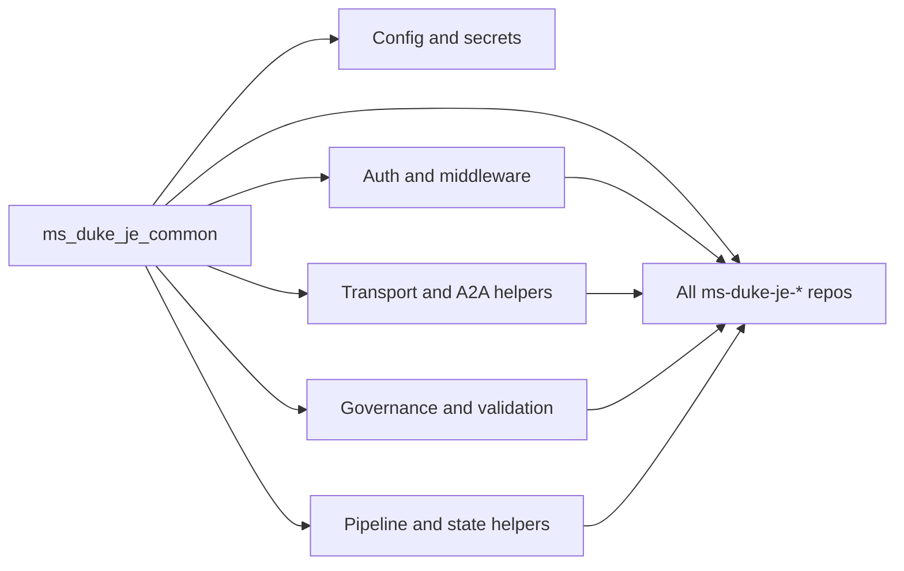
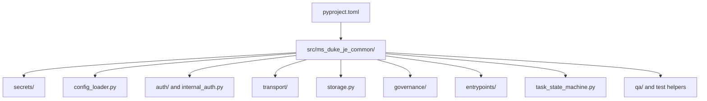

## AGENTS.md

## Repo Overview

- Repository: [ms-duke-je-common](README.md)
- Domain: shared platform utilities used by Duke MJE service repos
- Runtime model: a shared library, not an application service
- Primary goal: provide stable cross-cutting capabilities that the agent repos can rely on without duplicating logic

## What This Repo Does

This package centralizes reusable helpers for secrets loading, auth, storage, transport, task state handling, file classification, and operational support modules. Most higher-level agent repos depend on this package for common behavior that should remain consistent across services.

## Start Here

1. Read [README.md](README.md) to understand the published package surface and install extras.
2. Inspect [pyproject.toml](pyproject.toml) to see the available optional dependency groups and packaging metadata.
3. Review [src/ms_duke_je_common/__init__.py](src/ms_duke_je_common/__init__.py) to understand the top-level exports.
4. Inspect the module families under [src/ms_duke_je_common/](src/ms_duke_je_common/) to find the owning implementation for secrets, config, auth, transport, storage, governance, and state helpers.
5. Use [tests/](tests/) to confirm behavior changes, especially for config loading, auth, storage, and transport helpers.

## Repo Map

- [src/ms_duke_je_common/secrets/](src/ms_duke_je_common/secrets/): secret provider implementations
- [src/ms_duke_je_common/config_loader.py](src/ms_duke_je_common/config_loader.py): shared config registry client
- [src/ms_duke_je_common/config_register.py](src/ms_duke_je_common/config_register.py): config registration helpers
- [src/ms_duke_je_common/auth/](src/ms_duke_je_common/auth/): authentication helpers and middleware
- [src/ms_duke_je_common/internal_auth.py](src/ms_duke_je_common/internal_auth.py): internal authentication support
- [src/ms_duke_je_common/transport/](src/ms_duke_je_common/transport/): A2A and HTTP transport helpers
- [src/ms_duke_je_common/storage.py](src/ms_duke_je_common/storage.py): storage and file-manager helpers
- [src/ms_duke_je_common/governance/](src/ms_duke_je_common/governance/): content safety, rate limiting, and cost tracking
- [src/ms_duke_je_common/task_state_machine.py](src/ms_duke_je_common/task_state_machine.py): task-state transitions and event helpers

## Coding Standards

- Keep behavior stable across downstream repos; this package is shared infrastructure.
- Prefer explicit, small helpers over broad abstractions that hide important behavior.
- Add or update tests for any change that can affect auth, config, storage, transport, or state transitions.
- Preserve backward compatibility whenever possible, especially for exported functions and helper signatures.
- Keep optional dependency groups narrow and document when new extras are added.
- Prefer clear logging and error messages that make cross-repo debugging easier.

## Naming Conventions

- Use snake_case for modules, functions, variables, and file names.
- Use PascalCase for classes and dataclasses.
- Use UPPER_SNAKE_CASE for constants and environment variables.
- Keep package and module names descriptive of the shared capability they provide.
- Prefer names that explain the common behavior rather than the consuming repo.

## Where To Change What

- Secrets behavior: [src/ms_duke_je_common/secrets/](src/ms_duke_je_common/secrets/)
- Config registry behavior: [src/ms_duke_je_common/config_loader.py](src/ms_duke_je_common/config_loader.py) and [src/ms_duke_je_common/config_register.py](src/ms_duke_je_common/config_register.py)
- Auth behavior: [src/ms_duke_je_common/auth/](src/ms_duke_je_common/auth/) and [src/ms_duke_je_common/internal_auth.py](src/ms_duke_je_common/internal_auth.py)
- A2A and HTTP transport behavior: [src/ms_duke_je_common/transport/](src/ms_duke_je_common/transport/)
- Storage and file-manager behavior: [src/ms_duke_je_common/storage.py](src/ms_duke_je_common/storage.py)
- Governance helpers: [src/ms_duke_je_common/governance/](src/ms_duke_je_common/governance/)
- Task state helpers: [src/ms_duke_je_common/task_state_machine.py](src/ms_duke_je_common/task_state_machine.py)
- Package surface exports: [src/ms_duke_je_common/__init__.py](src/ms_duke_je_common/__init__.py)

## Additional Prompts for Agent

- "Before changing a helper here, identify every repo that imports it and check for contract impact."
- "When adding an optional dependency group, update pyproject.toml, requirements.txt, and the README install guidance together."
- "If auth or config behavior changes, add tests that cover both the success path and the failure path."
- "Prefer additive changes to exported APIs; avoid renaming or removing symbols unless the downstream repos are updated in the same change."
- "Keep this package generic; do not add repo-specific business logic that belongs in an agent service."
